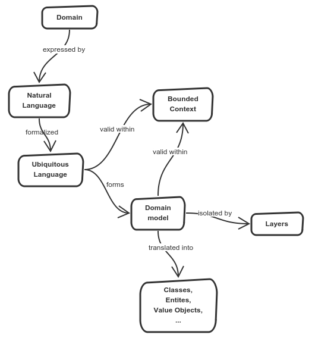

# 1. Overview

Domain-driven design is a software design that focuses on understanding underlying business. It is useful for long-term projects because it leads to high-quality software that serves users. It helps when dealing with difficult problems, keeps track of core problems and prevents us from getting lost in the code.

Domain is an area that project covers, it has its own terminology, requirements, problems to solve. Domain has its natural boundaries too, it does not cover everything.

* DDD is based on domain
* Domain is ...
* Domain in expressed by natural language
* Natural language is ... and can be formalized into ubiquitous language
* Ubiquitous language is ...
* Ubiquitous language is valid within bounded context
* Bounded context is ...
* Language in bounded context expresses model
* Model is ...
* Domain model is isolated by layers.
* Layer is ...
* Layers isolates domain model ...
* Model can be translated into code like classes, entities, value objects, aggregates

