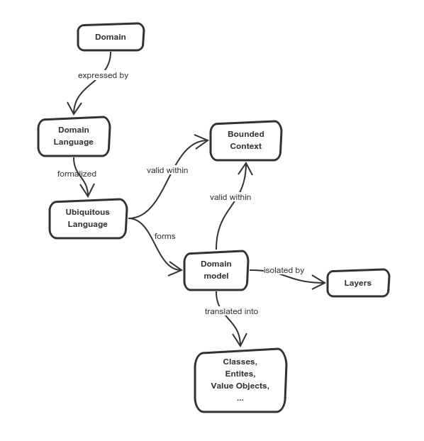

# 1. Overview

Domain-driven design is a software design that focuses on understanding underlying business. It is useful for long-term projects because it leads to high-quality software that serves users. It helps when dealing with difficult problems, keeps track of core problems and prevents us from getting lost in the code.

### Domain
The domain is an area that project covers, it has its own terminology, requirements, problems to solve. Domain has its natural boundaries too, it does not cover everything.

### Domain Language
Every domain has its own terms, its own language. A term in a domain means something completely different in another domain. Terms that are crucial are well known to everyone who understands a given domain. These terms form the domain language.

And yet the domain language is a natural language full of ambiguity, multiple terms that express the same, full of misunderstanding and crosstalks.

### Ubiquitous language
As we aren't domain experts, we have to learn the domain, from experts, by their language. Domain experts have to extract the most critical concepts and terms from their domain and teach us them. As we are learning, we use domain terms in communication, code, documentation, in communication with users of our system. These domain terms started to be everywhere, they became ubiquitous.

Ubiquitous language connects users, domain experts, programmers, so it creates project backbone. It may not be a bad idea to document key terms, especially if terms have conditions of use. The documentation may help new programmers, as well as users, to get into the project.

Be careful, ubiquitous language, this definitive, specific language must always come from domain experts or users, their stories, and their conversations. We must not invent our terms, our language. Never.

### Bounded Context
Language, terms, conditions, mental models - they are valid only within a given context, in a given boundary. The bounded context represents these boundaries.

We cannot use a term from a different company in our team because it needs context, a boundary that the term is valid in. We cannot use a model from a different team because the model is valid in different conditions - boundaries.

### Model
Language in a bounded context expresses model. Model, or mental model, is what we imagine when we hear a story. A story is told in a language within a concrete context. To be able of proper modeling we need to know the domain, ubiquitous language terms and we also have to know the bounded context.

Model is the picture we imagine. Modeling is a process that aims to capture key concepts of reality and ignores irrelevant details.

### Code
The code is a model representation, it is the model written down. We can also compose the model back by reading the code, and we do it often.

### Layers
To isolate the domain model code from the rest of the rest of system like persistence or user interface we use software layers.
The goal is to have the domain code as much separated as possible. We achieve this by interfaces that inverse dependencies and application objects that wrap domain objects but do not affect them. [diagram](layers_isolation.png)

## Concepts summary

