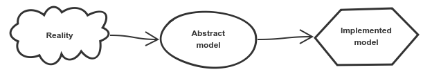
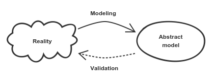

# Model

All of us model every day.
A friend tells us a joke, we imagine the situation and if we model it as is intended, we find the situation funny.
A customer wants to have a new functionality and while he speaks, we try to imagine what does the customer wants - we model.

## Modeling

Modeling is a process that aims to capture key concepts of reality.
Modeling also means to ignore anything irrelevant, and this is as important as capturing relevant concepts.

The reality contains everything important, all details, everything we know and much more that is hidden.
We are not able to describe the whole reality and describing it is not really our goal.

We can tell stories that cover important concepts of reality.
We can convert the stories to use cases.
To explain deeper these use cases we can use diagrams, images.
And in the end, we convert all this knowledge into a source code.

> **Not only Data**
> 
> Most of us are great in modeling data. But what about modeling responsibilities, modeling behavior? Let's focus also on these aspects of modeling for a better result.

## Validation

Once we have the abstract model in our heads and it is also described by documentation and in the diagrams, we should validate it.
Validation is done by domain experts who have to confirm or refute the abstract model.

Validation and modeling are bounded continuous processes.
The project evolves, our domain understanding evolves, so the model evolves as well.

## Model and Language

Modeling is a difficult process, it is difficult to say where to start, how deep should we go, what should we focus on, what to omit.
But we have one great tool that helps us, the language.

Domain expert stories, terms that they repeat over and over again, all these are good starting points.
The language also shapes the way we think, and when we think in domain terms, the abstract model is likely to be close to the reality.

# Implementation Model

There are always many ways how to implement the abstract model.
The implementation can be made in smooth and simple or in an overcomplicated way. It is surprisingly easy to end up with a complicated solution.
But we will take the effort and introduce strategies and concepts that will help us simplify the model.

## Concrete Association

Associations between objects are naturally two-ways. But it's really difficult to think, work and program with two-ways associations. We try to simplify them if it's possible.

Imagine you are modeling a product and it's price. We can imagine the price as a sticker on the product. The sticker is on the product and of course, the product is labeled with the sticker. So it seems there has to be a two-way association between price and sticker objects.

But does the price sticker care where is it stuck? We may find it irrelevant, so the association from product to price can be only one-way.

This simple change makes thinking about product and price much easier, and also the resulting code is simpler.
A two-way association is difficult to maintain and we should use it only where it is absolutely necessary.

## Entity

Who am I? I'm a unique person.
I can cut my hair, change a name if I marry, or have an accident and my body shape might change.
My look might change, people might call me differently, but it is still me.
It is my identity what identifies me, nothing else.

Entities have the same story.
They are unique in the system and if their properties changes, they are still the same entities.

### Identity

An entity is identified by an identity.
This has some practical consequences.
A unique entity must be only one in the system, stored as one piece of memory.
When we compare entities, we have to compare only their identities.
If the identity is the same, the entity is the same.

## Value Object

We have to paint a room, what do we need?
A paint of a given color.
While we are painting we do not care which drop of paint is where, as long as we have enough paint we are able to finish the job.
And if we spill a can, we can replace it with a new one without noticing a difference.

Value objects represent objects without identity.

As well as paint is identified by its color, a value object is identified by all of its properties.
If two value objects have the same properties, we are not able to distinguish them, they are identical for us.
Thanks to this property we do not care which instance we are using unless it has the right properties.

Value objects are immutable, side-effect free and easier to understand than entities.
We are not able to change value object properties, instead of that we have to create always a new one.
Immutability allows us also to share value objects over the whole system and save memory if necessary.

### Identity and Identifier

Entities are identified by an identity.
How do we select an entity from a collection?
We need a tool which also identifies an entity, and that tool can be an identifier.

An identifier can be a practical implementation of an identity.
Identifier as a value object really fit - if any property of an identifier is different, the identifier is different.
If all attributes of the identifier are the same, it is the same identifier.

## Aggregate

An aggregate is a group of objects that live and die together.
Aggregate parts do not make sense without each other, they make sense only if they are all together.

We cannot access inner objects of an aggregate from outside, we have to use the main object always, so-called aggregate root.
Aggregate is an encapsulated single unit (OOP starts to make sense!).
Thanks to the encapsulation, it is easy to understand the aggregate and it is also easy to refactor the internal structure of aggregate.

### Aggregates are Separated

Aggregates must be understood whole or not be understood at all, must be created wholly or not be created at all, must be persisted whole or not be persisted at all, must be received from a repository (database or any storage) whole or not be received at all.

This means that we cannot have associations between aggregates.
This separation forces us to think more about aggregates responsibilities, but it results in a much easier model and code.
