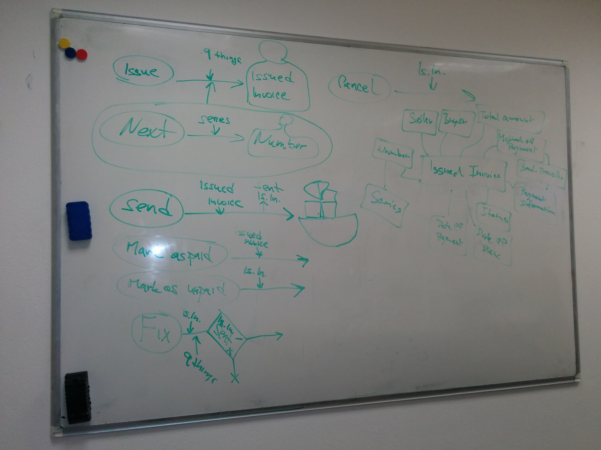
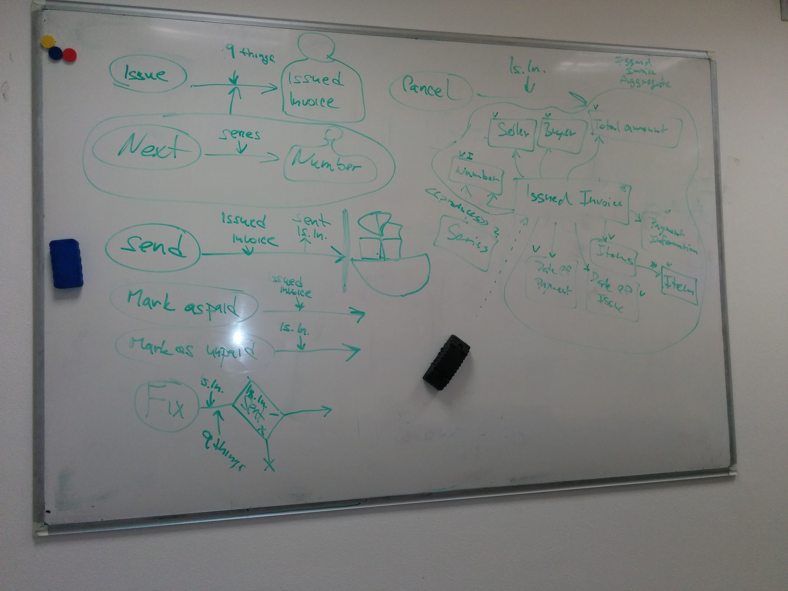

# Workshop - model

## Cíl

* Modelování
* Procesů
* Zodpovědností
* Napojení na externí svět
* Jaké informace kde potřebujeme

## Téma

Navazujeme na minulý workshop na téma **[jazyk](/2-language/workshop/workshop.md)**.

Podnikatel chce fakturační systém pro drobné živnostníky, který bude sám využívat a pronajímat.  
Ultimátní cíl: **Jednoduchý fakturační systém**

## Výsledek workshopu

### Procesy + "diagram tříd"

### Procesy + implementační diagram tříd

## Programování

Bez programování neuvidíte reálné prolbémy a benefity DDD.
Pojďte si naimplementovat to, co jste se dozvěděli.

* Připravil jsem repozitář, který si jenom naklonujete a hned programujete!
* https://github.com/simara-svatopluk/ddd-course-workshop
* Založte PR, a já Vám kód zreviduju (Ostrava do 28.11., Brno do 12.12.)
