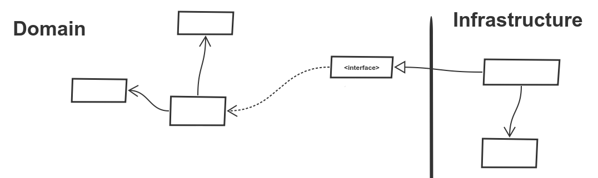

# Implementation

Modeling and discussing is fine, but without actual code, we lead only academical discussions.

## Value objects

We'll code value object `Items`, it represents a collection of value objects `Item`.

### Immutability

Value objects are immutable, it means they never change their state. The only way how they accept their state is by the constructor.

```php
class Item {
    //, For now, we don't care what is inside of Item
}

```

```php
class Items {

    /**
     * @var Item[]
     */
    private $items;

    public function __construct(array $items)
    {
        $this->items = $items;
    }
}
```

This class represents items, but cannot do anything. Let's add `add(Item)` operation.
But value objects are immutable, they cannot be changed.
The only way they can do anything is by returning a new value object. 


```php
class Items {

    /**
     * @var Item[]
     */
    private $items;

    public function __construct(array $items)
    {
        $this->items = $items;
    }

    public function add(Item $item): self
    {
        $items = $this->items;
        $items[] = $item;
        return new self($items);
    }
}
```

### Side-effect free functions

Value objects should contain functions that have no side-effects.
The side-effect is anything that changes system state or depends on the system state.

Example of a method that has the side-effect
```php
class Voucher {
    public function isValid(DateTime $validUntil): bool
    {
        return $validUntil <= new DateTime();
    }
}
```

This can be refactored to
```php
class Voucher {
    public function isValid(DateTime $validUntil, DatTime $now): bool
    {
        return $validUntil <= $now;
    }
}
```

Side-effect free functions guarantee that for the same input they always return the same output, so we can combine them without worrying about what will happen.
They are also pretty easy to test.

### Closure of Operation
In math, a set is closed under the operation if the performance of that operation on members of the set always produces a member of the same set.

For example, integers are closed under addition. `A + B = C` when `A` and `B` are integers, the result will be always an integer.

In the other hand division is not closed on integers `A / B = C` for example `3 / 4 = 0.75` results in a real number.

We care about the closures of operations because they are extremely easy to understand.
We know that all parameters are the same type and that the result is also the same type.
Our brain doesn't have to switch between different concepts, it has only one concept at a time.

A nice example of a closure in case of items can be a merge operation:
```php
class Items
{
    //...
    public function merge(Items $with): Items
    {
        $items = array_merge($this->items, $with->items);
        return new Items($items);
    }
}

//...
$merged = $items->merge($itemsFromExternalSystem);
```

When we look at the line with usage, it a nice look. It is so easy to think about it, so it seems we don't think at all.

In reality, we usually don't find tones of closure methods.
But it is a good idea to reduce the number of different types so the code is easier to read and understand.
For example our `Items::add(Item): Items` operation is almost closed as operate and returns `Items` and uses `Item` type.
It is much easier to understand it than for example `Items::calculate(Calculator): Result`.

## TDD

There was (and will be) written about TDD lot, and I don't want to repeat others.

I can strongly recommend [code retreat](https://www.coderetreat.org/) to start with TDD.
When I attended the event for the first time it was mind-blowing for me and it helped me with testing much more than articles I read before.

When we implement code modeled by DDD, it is easy, like very easy to implement it by TDD, so just do it.

## Layers

To isolate the domain model code from the rest of the rest of system like persistence or user interface we use software layers.
The goal is to have the domain code as much separated as possible.
We achieve this by interfaces that inverse dependencies and application objects that wrap domain objects but do not affect them.



### Domain

Domain layer contains our domain. Up to this point, it was everything we already discussed.

The domain contains also interfaces that provide access to parts that not our domain.

Imagine our domain use-case contain sending an e-mail, but our domain is not about sending e-mails.
Then we can create an interface that will do the sending e-mail use-case.
We use this interface in the domain layer and thus keep the domain layer clean, separated.

### Infrastructure

Infrastructure refers to the fundamental facilities and systems, it consists of sewers, pipes, electrical nets, water supply, garbage collecting and so on.

Infrastructure is a set of services and systems that keep us alive.
But it is also a set of services that we don't want to bother with.
Yes, we need sewers, but who wants to keep them clean? Or fix when something breaks?

Infrastructure is also disposable, interchangeable.
What happens when our factory needs a better power supply? We simply change cables or supplier.
We cannot rely on a specific infrastructure because it would tie us down.

The software infrastructure has the same story, it makes our system alive, but it has to be interchangeable.
Thanks to changeability we can postpone an important decision.
What database do we have to use? Should it be Postgres, MySQL? Does it have to be even relational?
Will our application be transactional heavy or read heavy? How many requests will we serve?
If we make infrastructure interchangeable, we don't have to answer all these questions at the beginning of the project,
we can postpone the decision or even change the decision later.

From the code point of view, the infrastructure layer implements domain interfaces.
