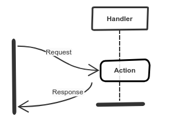
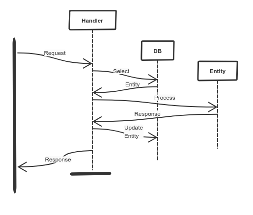
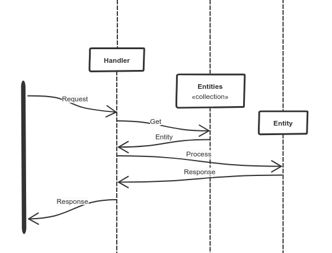
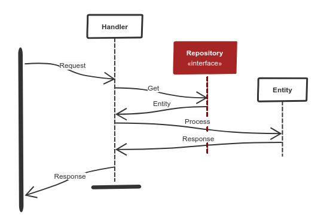

# Persistence

Persistence is a crucial part of any software project, we simply need to keep the system state.
We'll discuss possibilities and how DDD deals with saving and loading the state.

## Request-Response System

Typical system responses to a request, that is the basic functionality.
Additionally, it usually does also job aside creating a response and this job has likely need to use persistence.

A typical web system lives in sequence - request, job, response, die.
This means that it has to load all needed resources from persistence, process them, save them back to persistence and then return response (and then die).

The problem of such a system is that it mixes processing logic with persistence logic.
It is difficult to understand such logic and it is difficult to test such a system.

*BTW: If we select all needed data first, then the logic is already mixed because we need the knowledge what data we need from the persistence.*

*BTW 2:
This kind of system can be tested by mocking the persistence.
But mock tests are difficult to understand, maintain and shift persistence knowledge into logic tests.
They are generally not awesome and I don't recommend them.*

## In-memory system

Let's make a mental exercise - imagine a system that runs only in memory and processes requests sequentially.
This system needs just collections of objects where it stores the state.

Collections are part of the processing logic, so it is easy to understand and test the system.
One important note - there is no save operation because collections have references to their objects and when an object changes, it is changed also in the collection.

### Illusion of in-memory system

When we replace memory collections with persistent collections, everything works as same as with memory collections but we have a state.
So we have benefits of the in-memory system - easy to understand and tests and we have also a persistent state.
Persistent collections are called Repositories in DDD.

## Repository

The whole idea is about that we keep pretending that we have collections.
Clever and persistent collections, so-called repositories.
The domain layer would seem to live continually.

Repository, same as a collection, have the responsibility to *add* an object, *get* objects by identifier or complex criteria and eventually to remove an object.
There are also use cases that require aggregations like *How many objects are in the system*, *Total amount of all products in the warehouse*.
For these use cases, the repository can provide direct aggregation methods so we don't have to inefficiently fetch loads of objects.

Repositories are created for aggregates only because aggregates are our building blocks, our units.
They also always work with the whole aggregate, not with an internal part alone, not with a partial aggregate, always with the whole aggregate.

The repository is implemented in the domain layer because it works with domain objects.
But in the domain layer we should have no idea about any database nor any storage, so the repository is just an interface.

### Implementation

Repositories are interfaces and they need to be implemented, please read more about [implementation and infrastructure layer in previous materials](/4-implementation/implementation.md#layers).

### Persistence Responsibility

The repository can be responsible for persisting objects.
It would make some sense to have a saving method that instantly persists an object.

But there is no such use case with memory collections so we would have to bring infrastructure requirements into the domain.
If there was a persist operation, we'd have problems with transactions - one object is persisted and second, causes an exception while persisting, so what now?

The solution is simple.
Object persistence is not the repository's responsibility.
Someone else is responsible for the persistence.
We can use an infrastructure middleware that is responsible for the persistence.

When we use an advanced persistence tool, it usually deals with persistence by flushing an object manager.
But it's still possible to keep references to objects we used and flush them into storage after the domain use case is done.
This system also allows us to use transactions if the persistence system supports them.

